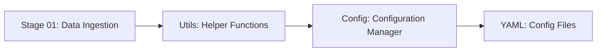
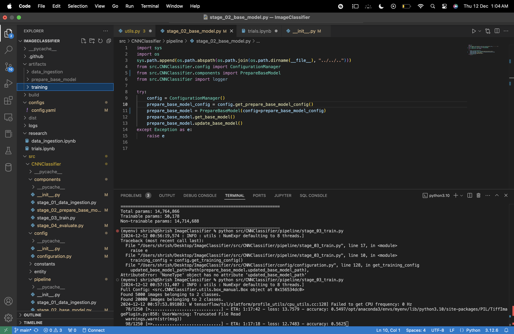

---

# **CNN Image Classifier Project (End to End Implemetation)**
--- 

## **Overview**
This project is built to learn and implement an end-to-end deep learning pipeline for image classification. It covers everything from data ingestion to model prediction and deployment, ensuring a holistic understanding of how real-world deep learning projects are structured and executed.

---

## **Key Features**
- **Modular Structure**: The project follows a modular design for reusability and scalability.
- **Configuration Management**: Uses configuration files to manage settings and parameters for different stages.
- **Automation**: Shell scripts and setup files automate repetitive tasks like environment setup and dependency installation.
- **Logging**: Each step logs essential information to monitor the progress and debug issues.

---

## **File and Directory Overview**
### **1. setup.py**
- **Purpose**: Automates the packaging and installation of the project as a Python package.
- **What it does**:
  - Defines the project metadata (e.g., name, version, author).
  - Specifies dependencies required to run the project.
  - Allows you to install the project using `pip install .`.
- **Why it’s important**: Ensures consistency when sharing the project or deploying it on different systems.

### **2. setup.cfg**
- **Purpose**: Complements `setup.py` by separating configuration details from code.
- **What it contains**:
  - Metadata about the project (e.g., description, license, URL).
  - Options for building, testing, and installing the package.
- **Why it’s important**: Simplifies `setup.py` and provides a cleaner way to manage configuration.

### **3. YAML Files**
- **Purpose**: Store configuration settings in a human-readable format.
- **What it contains**:
  - Parameters for various stages like data ingestion paths, model parameters, and logging settings.
  - Example: `config.yaml`:
    ```yaml
    artifacts_root: "artifacts"
    data_ingestion:
      root_dir: "artifacts/data_ingestion"
      raw_data_dir: "artifacts/data_ingestion/raw_data"
    ```
- **Why it’s important**: Keeps the code flexible by separating hardcoded values into a configuration file.

### **4. Shell Scripts**
- **Purpose**: Automate repetitive tasks like setting up the environment and running the pipeline.
- **What it does**:
  - Activates the virtual environment.
  - Installs dependencies.
  - Executes pipeline stages.
- **Why it’s important**: Saves time and reduces the chance of manual errors.

### **5. pyproject.toml**
- **Purpose**: A modern configuration file for Python projects, defining build-system requirements.
- **What it contains**:
  - Metadata for the project.
  - Dependencies and build requirements.
- **Why it’s important**: Ensures compatibility with tools like `pip` and `tox`.

---

## **Why Use Configuration Files?**
Configuration files are crucial because they:
- **Improve Flexibility**: Allow easy modification of parameters without changing the code.
- **Enhance Reusability**: Enable the same codebase to work with different datasets or environments.
- **Promote Scalability**: Centralize settings, making it easier to update and maintain.
- **Simplify Debugging**: Provide a single source of truth for parameters, making it easier to track and resolve issues.

---

## **Connecting the Stages**
### **1. Prediction Stage: stage_01_data_ingestion.py**
- **Purpose**: Ingests raw data for training and validation.
- **Key Steps**:
  1. Reads configuration settings from `config.yaml` using the `read_yaml` function in `utils.py`.
  2. Creates required directories using the `create_directory` function from `utils.py`.
  3. Logs every action for transparency and debugging.

### **2. utils.py**
- **Purpose**: Provides utility functions for common tasks.
- **Functions Used**:
  - `read_yaml`: Reads YAML configuration files and returns a Python object.
  - `create_directory`: Ensures required directories exist or creates them.

### **3. configuration.py**
- **Purpose**: Acts as the manager for all configuration-related operations.
- **How it Works**:
  1. Reads `config.yaml` using `read_yaml` from `utils.py`.
  2. Provides easy access to configuration parameters for different pipeline stages.

### **4. config.yaml**
- **Purpose**: Defines all configuration settings for the project.
- **How it Works**:
  - Stores paths, parameters, and other settings required for different stages.
  - Ensures separation of logic and configuration.

---

## **How It All Fits Together**
1. **Stage Initialization**:
   - `stage_01_data_ingestion.py` starts by initializing `ConfigurationManager` from `configuration.py`.
2. **Configuration Reading**:
   - `ConfigurationManager` reads the `config.yaml` file via `utils.read_yaml`.
3. **Directory Management**:
   - Directories specified in `config.yaml` are created using `utils.create_directory`.
4. **Logging**:
   - Every action is logged, making the process transparent and easy to debug.

---

### Visual Workflow Connection

Here is the workflow of how different components interact:


---



---

### Base Model Creation

- The base model is built using **VGG16**, a pre-trained convolutional neural network widely used for image classification tasks.
- **Key Features**:
  - Transfer learning from ImageNet weights.
  - Customization of the fully connected layers for specific classification tasks.

---

### Training

- The training process involves fine-tuning the VGG16 model on a custom dataset.
- Techniques Used:
  - Data augmentation to improve generalization.
  - Adaptive optimizers (e.g., Adam) for effective convergence.
  - Early stopping to prevent overfitting.

---

### Validation of Model

- The validation phase evaluates the model's performance on unseen data.
- Metrics Used:
  - Accuracy
  - Precision, Recall, F1-Score
  - Loss curves

---

### Docker File Creation

- A **Dockerfile** is created to containerize the project, ensuring consistency across different environments.
- **Key Components**:
  - Base image with Python and required dependencies.
  - Copying project files into the container.
  - Setting up the entry point for the application.

---

### Usage of Streamlit

- **Streamlit** is used to create a user-friendly web interface for the model.
- Features:
  - Upload images for prediction.
  - Display results and metrics interactively.
- **Why Streamlit?**
  - Quick and simple deployment.
  - Interactive visualization capabilities.

---

Feel free to contribute to the project or raise issues for any bugs or suggestions!

---


